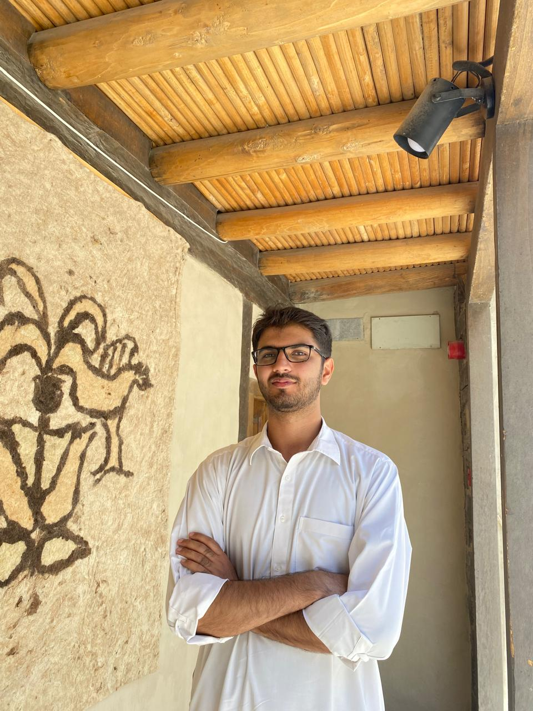

  
  
  <h3> Muhammad Bilal </h3>
  
I am an AI Engineer and researcher passionate about building applications in AI and robotics.

   
  
Currently working on AI products at Smart-IS International, designed to enhance warehouse operations and supply chain managment. Previosuly worked at Intelligence, Knowledge, and Experience Design and Research lab *IKNEX* where I worked on enhancing and evaluating a knowledge graph related to Tafsir of Tabari

  
      <!-- Added 3 line breaks -->

    <a href="https://github.com/Bambokyo" target="_blank">GitHub</a> | 
    <a href="https://www.linkedin.com/in/mbilal-1608-pk/e" target="_blank">LinkedIn</a> | 
    <a href="bilal001.w@gmail.com">Email</a>

---

## Thoughts & Writings
A collection of my articles on AI, technology, and professional experiences.  
[Read My Blog →](./blog)

---

## Resume
Download my detailed resume to learn more about my experience and skills.  
[Download Resume (PDF) →](./Muhammad_Bilal_Resume.pdf)

---
